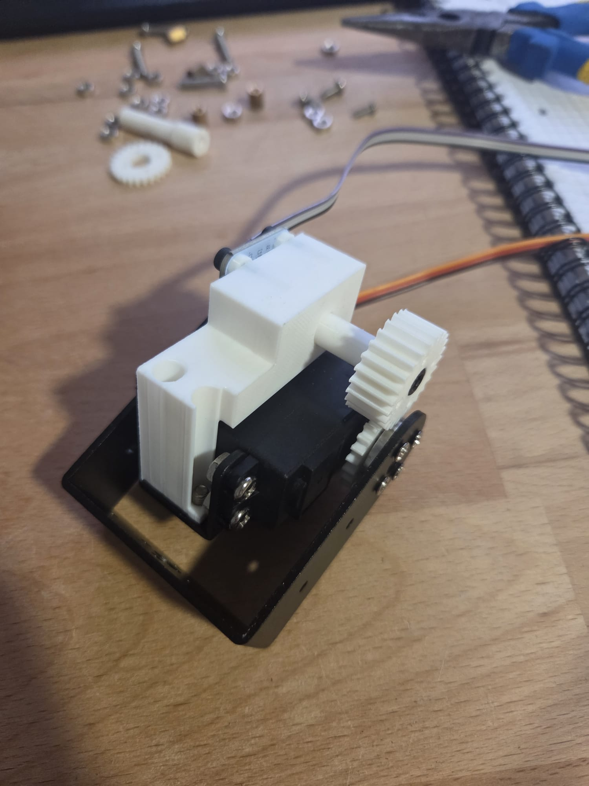

Printing was done on a [Bambulab A1 mini](https://eu.store.bambulab.com/de/products/a1-mini) 3D-Printer using [Bambulab PLA Basic](https://eu.store.bambulab.com/de/products/pla-basic-filament) Filament

All modes were created using FreeCAD and Sliced using Bambu Studio

Motor numbers are assigned ascending from bottom to top (lowest = 1, highest = 6)

### Attaching an Encoder to Motor 2

To add an Encoder to Motor 2, the following objects are required additionally:

- Additional parts
  - AS5600 Encoder and corresponding Magnet
  - 1 M4x12mm screw
  - 4 M3x8mm screws
  - Ribbon cable (or any other cable)
- 3D-printed parts
  - 4x basic_spacer_enc/basic_spacer.stl
  - 1x axis_encoder/bolt_magnet_holder.stl
  - 1x encoder_mount/general_mount_v4_3.stl
  - 1x servo_horn_gear/servo_horn_gear.stl
  - 1x axis_gear/axis_gear.stl


1. solder ribbon cable onto the ```encoder's``` VCC, GND, SDA and SCL
2. put ```servo_horn_gear``` on the back side of the servo horn and screw in place when adding the next segment of the robot
3. secure ```general_mount``` using the two screws that hold the motor mount in place that are further away from the axis
4. apply any kind of grease (eg. WD-40) to the middle (the slim part) of ```bolt_magnet_holder```
5. fit the slimmer edge of ```bolt_magnet_holder through``` the biggest hole in general_mount
6. add the encoder's magnet to the slot in the back of ```bolt_magnet_holder```
7. fit the four ```M3x8mm``` screws through the encoder PCB's mounting bores
8. between ```general mount``` and the ```encoder``` pcb, addd the four ```basic_spacers```.
9. screw the ```encoder``` in place
10. screw the ```M4x12``` screw through ```axis_gear``` so that the screw's head can sink into the gear
11. screw the ```m4x12``` screw attached to the ```axis_gear``` into the front side of ```bolt_magnet_holder```



